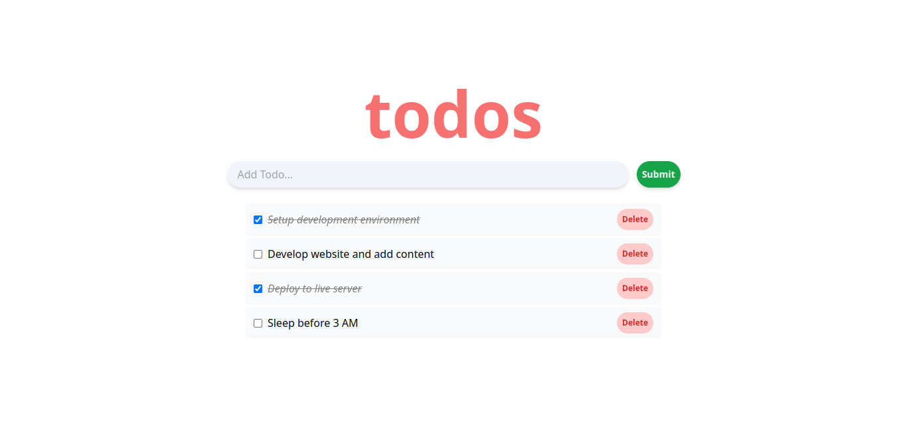

# Todo List with React

> **In this app, users should be able to:**

> - Add new tasks
> - Edit tasks
> - Remove tasks
> - Mark tasks as completed

## Screenshot

## Built With

- Html, Sass
- React, Tailwind
- Webpack, PostCSS

## Get Started

To get a clone of the project, run `git clone git@github.com:jssol/todo-list-react.git && cd $_`

### Available Scripts

In the project directory, you can run:

**`npm install`**

Gets all the required dependencies of the projects.

**`npm start`**

Runs the app in the development mode.\
Open [http://localhost:3000](http://localhost:3000) to view it in your browser.

The page will reload when you make changes.\
You may also see any lint errors in the console.

**`npm test`**

Launches the test runner in the interactive watch mode.\
See the section about [running tests](https://facebook.github.io/create-react-app/docs/running-tests) for more information.

## Authors

👤 **Jonathan Sivahera**

- GitHub: [@jssol](https://github.com/jssol)
- Twitter: [@jsivahera](https://twitter.com/jsivahera)
- LinkedIn: [jsivahera](https://linkedin.com/in/jsivahera)

## 🤝 Contributing

Contributions, issues, and feature requests are welcome!

Feel free to check the [issues page](../../issues/).

## Show your support

Give a ⭐️ if you like this project!

## 📝 License

This project is [AGPL-3.0](./LICENSE) licensed.